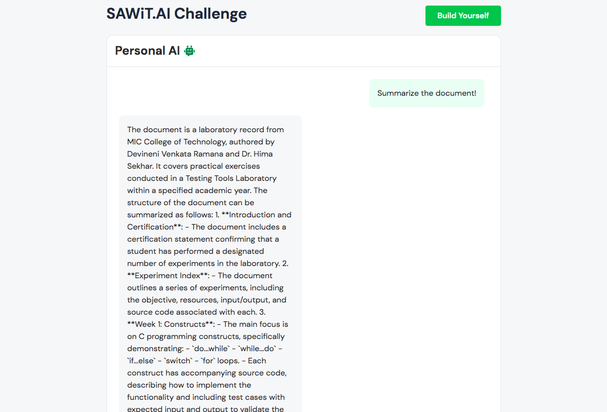

# Personal AI – Document Summarizer using GUVI’s RAG Model

This web app performs real-time document summarization and contextual Q&A using GUVI’s RAG (Retrieval-Augmented Generation) platform. Developed as part of the SAWiT.AI Challenge, the app integrates vector database search with transformer-based generation to provide accurate, context-aware answers from uploaded documents.

---

## 🔧 Tools & Technologies

- GUVI RAG Platform (SAWiT.AI Challenge)  
- Vector Database + Transformer Generator  
- Python (backend processing)  
- Web Interface via GUVI platform

---

## 🌐 Live Demo

Try the live app here: [GUVI Personal AI App](https://www.guvi.in/rag/fa6b3745-7d36-45ed-acf2-e52cf1cd4dcd/)

---

## 📸 Screenshot

---

## 🧠 Description

Personal AI is a Generative AI application that allows users to upload documents (PDF/DOC) and receive concise, contextual summaries and answers. It uses the Retrieval-Augmented Generation approach to combine the benefits of large language models with document retrieval, providing accurate and relevant information.

---

## 👩‍💻 Author

Shaik Kashifa Hussaini  
- LinkedIn: [linkedin.com/in/shaik-kashifa-hussaini-5212282b7](https://www.linkedin.com/in/shaik-kashifa-hussaini-5212282b7)  
- GitHub: [github.com/KashifaHussaini](https://github.com/KashifaHussaini)

---

## 📜 License

This project is licensed under the MIT License – see the LICENSE file for details.
